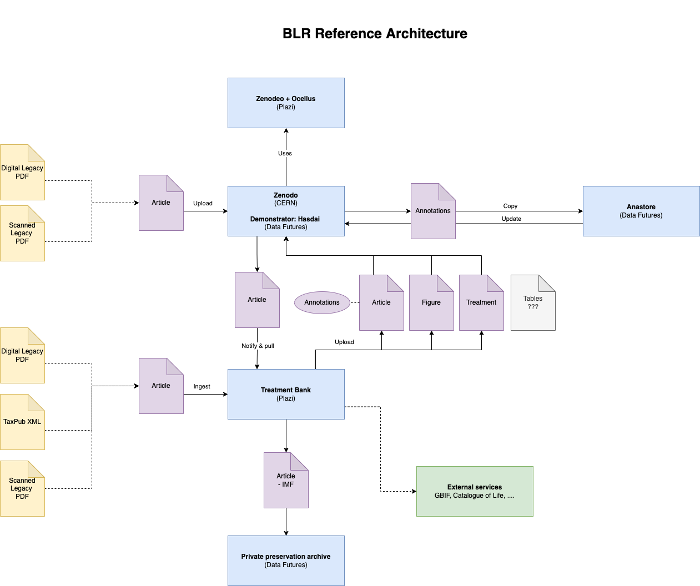

# Arcadia Projects

## Arcadia 1 (2017-2020)

[workplan](https://drive.google.com/drive/folders/0B_yrQwn4yBySaW03bWtuRlZBa3M?resourcekey=0-HdksmdeDPzuqN6fUvwg62g) (Google Docs) submitted and accepted

## Arcadia 2 (2022-2025)

- Dates:
  - accepted: April 29, 2022
  - starting date: July 1, 2022
  - end date: June 30, 2025
- [Workplan](https://docs.google.com/document/d/1JxcnQbgnNQ859DxSRVs9a7BSHgCM5QrA/edit)
- Meetings:
  - 2022
    - Sep 26-30, 2022. [Arcadia sprint 1 at CERN](https://github.com/plazi/arcadia-2/blob/main/sprint%201%2020220930.md). 
  - 2023
    - Jan 29-Feb 3, 2023. [Arcadia sprint 2 at CERN](https://github.com/plazi/arcadia-project/blob/master/sprint%202%2020230130.md)
    - Oct 30 - Nov 3, [Arcadia sprint 3 at CERN](https://github.com/plazi/arcadia-project/blob/master/sprint%203%2020231029.md)
  - 2024
    - Feb 2024, sprint 4  at CERN
    - Aug 19-21, 2024. Arcadia sprint 5 in Disentis
    - Aug 21-24, 2024. [Bouchout +10, Disentis](https://github.com/plazi/bouchout-10)
  - 2025
    - Feb 2025. Arcadia sprint 6 at CERN
- [management](https://github.com/plazi/arcadia-2) (restricted access)
- Partners
  - [anestore/IIIF service in Zenodo](https://github.com/plazi/collaborations_services/issues/94) 
  - [Data Futures](https://github.com/plazi/collaborations_services/projects/8)

## BLR Architecture

[Annotation enrichtment workflow in anastore](https://github.com/plazi/arcadia-project/wiki/Annotation-enrichment-in-anastore-workflow)
## Related Projects
* [TreatmentBank development](https://github.com/plazi/arcadia-project/projects/12)
* see also for [annotations ascription at DF](https://github.com/data-futures/ascription-project)
* [Inveniosoftware](https://github.com/inveniosoftware/invenio-app-rdm)
